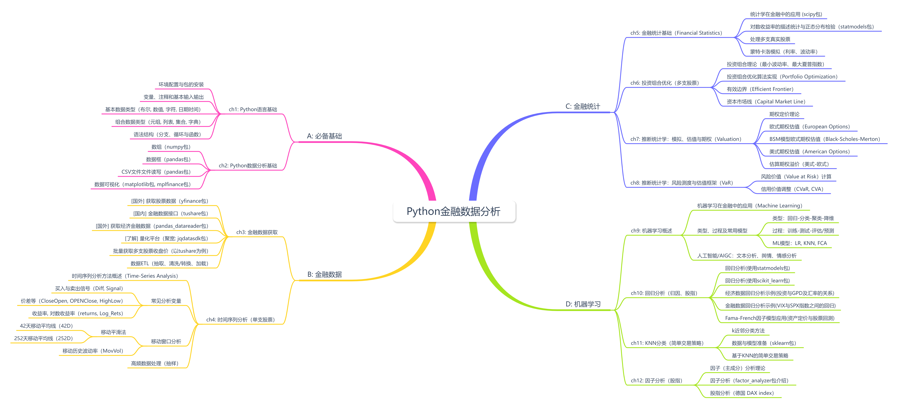

# Python金融数据分析(FinanceDA)

## 项目简介

一个包含股票数据下载、分析、可视化、回测、优化等功能的项目。
作者：Ye Junjie (Nickname: Brice)
创建时间：2021年5月9日
最后更新时间：2025年12月1日

### 主要功能模块

```python
from financeDA.class_price_list import PriceList # 价格列表数据(股票、期货、期权等), 如股票收盘价、股票收益率等 
from financeDA.class_stock_data import StockData # 股票数据，[Close, High, Low, Open, Volume] 及主要扩展指标[Diff, Signal, Close_Open, Returns, Log_Returns, 42d, 252d, Mov_Vol等]
from financeDA.class_stock_po import StockPO  # 投资组合优化（股票）

from financeDA import stat_describe, stat_norm_tests, stat_gen_paths  # 统计描述、正态性测试、生成随机路径
from financeDA import plot_line, plot_candle, plot_hist, plot_QQ, stock_diff, stock_tsa, stock_tests # 可视化：折线图、蜡烛图、直方图、QQ图、股票收益率、股票时间序列分析、股票统计测试
from financeDA import ff_reg   # 因子数据回归分析
from financeDA import gbm_mcs_stat, gbm_mcs_dyna, gbm_mcs_amer, option_premium # 期权定价相关：GBM模型静态模拟、动态模拟、美式期权模拟、期权溢价
from financeDA import bsm_call_imp_vol, bsm_call_value, bsm_vega  # 期权定价相关：BSM模型隐含波动率、期权价值、期权Vega
from financeDA import var_gbm, var_jd, var_diff, var_cva, var_cva_eu  # 风险价值相关：GBM模型风险价值、JD模型风险价值、差异风险价值、CVA风险价值、CVA风险价值（欧式期权）
from financeDA import hello_financeda # 打印hello_financeda

```

### 致谢

Hilpisch(希尔皮斯基): Python金融大数据分析（大部分代码的原始来源参考）
段小手: 深入浅出Python量化交易实战（蜡烛图,基于KNN的简单交易策略两个部分有参考）

## 快速开始

### 安装financeDA包

先安装python ，要求3.13.5以上，推荐3.14.0
然后 下载安装financeDA包

```bash
pip install financeDA
```

### 单支股票数据的下载、分析、可视化

```python
from financeDA.class_stock_data import StockData # 股票数据，[Close, High, Low, Open, Volume] 及主要扩展指标[Diff, Signal, Close_Open, Returns, Log_Returns, 42d, 252d, Mov_Vol等]
from financeDA import plot_line, plot_candle, plot_hist, plot_QQ, stock_diff, stock_tsa, stock_tests # 可视化：折线图、蜡烛图、直方图、QQ图、股票收益率、股票时间序列分析、股票统计测试

df_stock = StockData("BABA", start="2020-01-01", end="2025-12-20", source="yfinance").DF
print(df_stock.head())

plot_line(df_stock["Close"])
plot_candle(df_stock[-21:0])
plot_hist(df_stock["Returns"])
plot_QQ(df_stock["Log_Returns"])

stock_diff(df_stock)
stock_tsa(df_stock)
stock_tests(df_stock)
```

### 投资组合优化（多支股票）

```python
import numpy as np
import pandas as pd
from financeDA.class_stock_data import StockData
from financeDA.class_stock_po import StockPO

stocks = {
    '600031.SH': '三一重工', 
    '601138.SH': '工业富联', 
    '000768.SZ': '中航西飞', 
    '600519.SH': '贵州茅台'
    }

sdpo = StockPO(stocks, source="tushare", token="your tushare token")

print(sdpo.data.tail())
weights,results = sdpo.po_random()
print(weights,results)

sdpo.po_mc(200000)  #默认2000次，可加大模拟次数

opts = sdpo.po_max_sharpe()
optv = sdpo.po_min_vol()
print(opts, optv) #手动计算最大夏普率和最小波动率的投资组合权重

sdpo.po_ef(trets=np.linspace(0.06, 0.15, 30))  # 手动计算有效边界，可不断调整trets的取值以获取最佳效果
sdpo.po_cml() # 手动计算有效边界下的最大夏普率组合(资本市场线)

```

### 使用因子回归做简单投资策略

```python

from financeDA  import ff_reg
stocks={
        "600100.SH": "同方股份",
        "600626.SH": "申达股份",
        "000630.SZ": "铜陵有色",
        "000850.SZ": "华茂股份",
        "600368.SH": "五洲交通",
        "603766.SH": "隆鑫通用",
        "600105.SH": "永鼎股份",
        "600603.SH": "广汇物流",
        "002344.SZ": "海宁皮城",
        "000407.SZ": "胜利股份",
        "000883.SZ": "湖北能源"
        }
df = ff_reg(stocks=stocks, start_date='2024-10-01', end_date='2025-10-31', mode=5)
print(df)
outfile = "ff_reg.csv"
df.to_csv(outfile)

```

## 项目依赖

python版代码要求在[3.13.5]以上，推荐 [3.14.0] 版本。

### 使用uv进行管理

项目配置文件：[project.toml]

```bash
uv python install 3.14
uv python pin 3.14
uv sync
uv lock
```

### 使用Pip进行管理

安装需要的包(项目的包依赖文件：[requirements.txt])

```bash
pip install numpy pandas matplotlib mplfinance scipy
pip install pandas_datareader yfinance tushare jqdatasdk
pip install scikit-learn statsmodels factor-analyzer

# 为了提高安装速度，可在每条命令后添加 -i 以使用国内的pip源。如：
pip install pandas -i https://pypi.tuna.tsinghua.edu.cn/simple

# 也可直接使用requirements.txt文件安装
pip install -r requirements.txt -i https://pypi.tuna.tsinghua.edu.cn/simple

#某些python版本下(如python3.9.5时), 如果执行yfinance时报错，可能需要调整urllib3包的版本
pip install urllib3==1.25.11 
```


## Python金融数据分析思维导图


